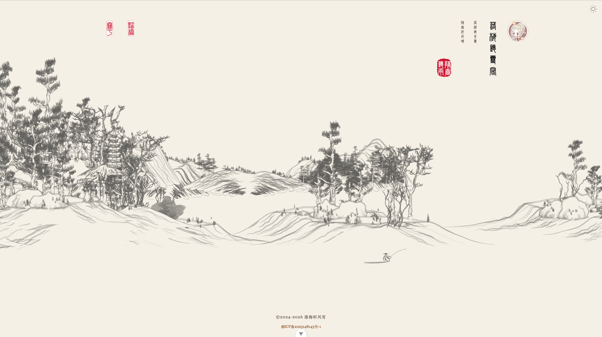
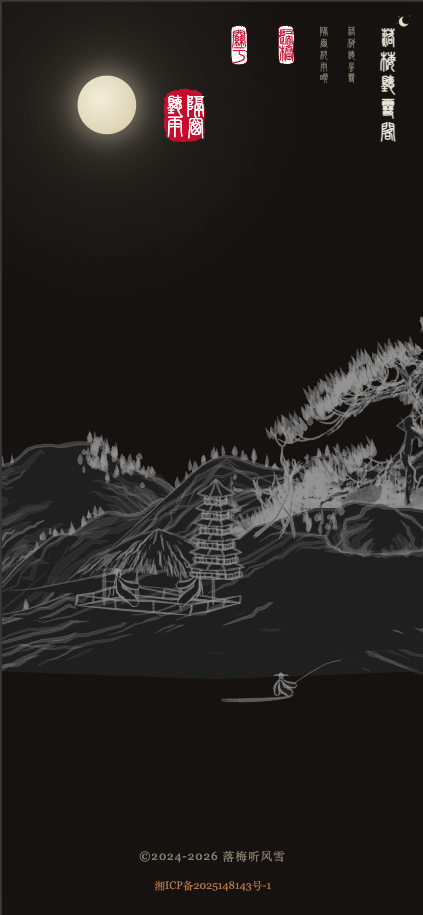

# valaxy-theme-shuimo 水墨

[](https://www.npmjs.com/package/@jobinjia/valaxy-theme-shuimo)

一个中国水墨风格的 [Valaxy](https://github.com/YunYouJun/valaxy) 博客主题。宣纸纹理、毛笔笔触、印章篆刻、四季花卉 —— 以码为墨，以屏为纸。

An ink-wash (水墨) style blog theme for [Valaxy](https://github.com/YunYouJun/valaxy). Xuan paper textures, brush strokes, seal stamps, and seasonal decorations.

## 预览 / Preview

| Light | Dark |
|-------|------|
|  |  |

## 特性 / Features

- 宣纸背景纹理（支持 processed / aged / gold 变体）
- 毛笔笔触线条替代 CSS 硬线
- 中国印章（阴章/阳章，圆形/椭圆）
- 四季花卉装饰自动切换
- 首页山水画英雄区
- 深色模式支持
- i18n：UI 基础文案（上一篇/下一篇/返回）随 `zh-CN` / `en` 自动切换；主题其余文案（站名、副标题、印章、装饰性 copy）仍以中文书写
- 内置峄山碑篆书字体

## 安装 / Install

```bash
pnpm add @jobinjia/valaxy-theme-shuimo
```

可选安装 `@jobinjia/shuimo-core` 以启用 Canvas 宣纸纹理生成：

```bash
pnpm add @jobinjia/shuimo-core
```

## 使用 / Usage

在 `valaxy.config.ts` 中配置：

```ts
import type { ThemeConfig } from 'valaxy-theme-shuimo'
import { defineConfig } from 'valaxy'

export default defineConfig<ThemeConfig>({
  theme: 'shuimo',

  themeConfig: {
    header: {
      title: '墨韵书斋',
      subtitle: '以墨会友 · 以文载道',
    },

    nav: [
      { text: '归档', link: '/archives' },
      { text: '关于', link: '/about' },
    ],

    sidebar: {
      author: {
        name: '墨客',
        motto: '以码为墨，以屏为纸',
        avatar: '/avatar.jpg',
      },
    },

    stamp: {
      enable: true,
      author: '墨',
      type: 'yin',
    },
  },
})
```

## 主题配置 / Theme Config

| 配置项 | 类型 | 默认值 | 说明 |
|--------|------|--------|------|
| `colors.primary` | `string` | `'#8B4513'` | 主色（古铜） |
| `colors.stamp` | `string` | `'#C8102E'` | 印章色（朱红） |
| `fonts.serif` | `string` | `'Noto Serif SC', ...` | 衬线字体 |
| `fonts.title` | `string` | - | 标题字体（如篆书） |
| `fonts.body` | `string` | - | 正文字体 |
| `fonts.url` | `string` | - | 外部字体 URL |
| `header.title` | `string` | `'墨韵书斋'` | 站名 |
| `header.subtitle` | `string` | `'以墨会友 · 以文载道'` | 副标题 |
| `footer.since` | `number` | `2024` | 建站年份 |
| `footer.powered` | `boolean` | `true` | 显示 Valaxy 驱动标识 |
| `footer.beian.enable` | `boolean` | `false` | 启用备案号 |
| `footer.beian.icp` | `string` | `''` | ICP 备案号 |
| `sidebar.author.name` | `string` | `'墨客'` | 作者名（About / 归档 / 分类 / 首页竖排导航 / 文章页均会读取） |
| `sidebar.author.motto` | `string` | `'以码为墨，以屏为纸'` | 座右铭 |
| `sidebar.author.avatar` | `string` | - | 头像路径（首页竖排导航、文章页左上角使用） |
| `nav` | `NavItem[]` | `[]` | 导航项 `{ text, link, icon? }` |
| `stamp.enable` | `boolean` | `true` | 启用印章 |
| `stamp.author` | `string` | `'墨'` | 印章文字 |
| `stamp.type` | `'yin' \| 'yang'` | `'yin'` | 阴章/阳章 |
| `stamp.shape` | `'auto' \| 'circle' \| 'ellipse'` | `'auto'` | 印章形状 |
| `decorations.enable` | `boolean` | `true` | 启用装饰 |
| `decorations.seasonAware` | `boolean` | `true` | 四季花卉自动切换 |
| `decorations.heroLandscape` | `boolean` | `true` | 首页山水画 |
| `decorations.curtainColor` | `ThemeModeColor` | `''` | 首页幕布颜色，默认跟随纸张底色；支持 `string` 或 `{ light, dark }` |
| `decorations.curtainPaperColor` | `ThemeModeColor` | `''` | 首页幕布宣纸底色，默认跟随 `xuanPaper.variant`；支持 `string` 或 `{ light, dark }` |
| `decorations.opacity` | `number` | `0.12` | 装饰透明度 |
| `xuanPaper.enable` | `boolean` | `true` | 启用宣纸纹理 |
| `xuanPaper.variant` | `'processed' \| 'aged' \| 'gold'` | `'processed'` | 纸张变体 |
| `brushStrokes.enable` | `boolean` | `true` | 启用毛笔线条 |

### `ThemeModeColor`

部分颜色配置（如 `decorations.curtainColor` / `decorations.curtainPaperColor`）支持按亮/暗模式分别指定：

```ts
type ThemeModeColor = string | { light?: string, dark?: string }
```

- 传字符串：亮暗模式共用同一个值
- 传对象：可只写 `light` 或 `dark`，未指定的一侧走主题内置默认值

```ts
themeConfig: {
  decorations: {
    // 单值写法
    curtainColor: '#E8D7A5',
    // 分模式写法
    curtainPaperColor: { light: '#E8D7A5', dark: '#1D2230' },
  },
}
```

## 开发 / Development

```bash
# 安装依赖
pnpm install

# 启动 demo 站点
pnpm dev

# 代码检查
pnpm lint

# 类型检查
pnpm typecheck

# 构建 demo (SSG)
pnpm build
```

## 致谢 / Credits

- [shan-shui-inf](https://github.com/LingDong-/shan-shui-inf) — 山水画生成算法参考

## License

MIT
