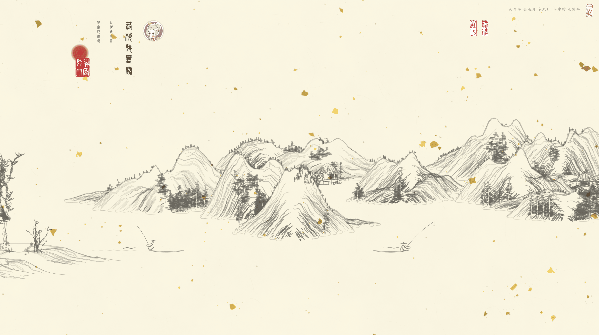
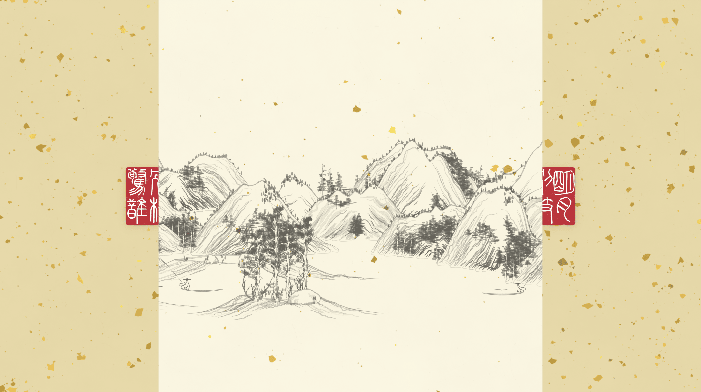

# valaxy-theme-shuimo 水墨

[](https://www.npmjs.com/package/@jobinjia/valaxy-theme-shuimo)

一个中国水墨风格的 [Valaxy](https://github.com/YunYouJun/valaxy) 博客主题。宣纸纹理、毛笔笔触、印章篆刻、四季花卉 —— 以码为墨，以屏为纸。

An ink-wash (水墨) style blog theme for [Valaxy](https://github.com/YunYouJun/valaxy). Xuan paper textures, brush strokes, seal stamps, and seasonal decorations.

## 预览 / Preview

| Light                                 | Dark                                         |
| ------------------------------------- | -------------------------------------------- |
|  |  |

开屏幕布动效 / Curtain reveal animation：



## 特性 / Features

- 宣纸背景纹理（支持 processed / aged / gold 变体）
- 毛笔笔触线条替代 CSS 硬线
- 中国印章（阴章/阳章，圆形/椭圆）
- 四季花卉装饰自动切换
- 首页山水画英雄区
- 深色模式支持
- i18n：UI 基础文案（上一篇/下一篇/返回）随 `zh-CN` / `en` 自动切换；主题其余文案（站名、副标题、印章、装饰性 copy）仍以中文书写
- 内置峄山碑篆书字体

## 安装 / Install

```bash
pnpm add @jobinjia/valaxy-theme-shuimo
```

可选安装 `@jobinjia/shuimo-core` 以启用 Canvas 宣纸纹理生成：

```bash
pnpm add @jobinjia/shuimo-core
```

可选安装 `@jobinjia/vite-plugin-shuimo-font-subset` 以在站点构建时按实际用字进一步裁剪内置篆书字体（`yishanbeizhuanti.woff2`）。不安装也能正常使用，主题会回退到打包内的 ~280KB top-1000 汉字子集；安装后构建产物体积通常可降到几十 KB：

```bash
pnpm add -D @jobinjia/vite-plugin-shuimo-font-subset
```

启用后无需任何配置 —— 主题会自动加载该插件并扫描 `pages/**/*.{md,mdx,vue}` 与 `valaxy.config.{ts,js,mjs}` 收集字符。

## 使用 / Usage

在 `valaxy.config.ts` 中配置：

```ts
import type { ThemeConfig } from 'valaxy-theme-shuimo'
import { defineConfig } from 'valaxy'

export default defineConfig<ThemeConfig>({
  theme: 'shuimo',

  themeConfig: {
    header: {
      title: '墨韵书斋',
      subtitle: '以墨会友 · 以文载道',
    },

    nav: [
      { text: '归档', link: '/archives' },
      { text: '关于', link: '/about' },
    ],

    sidebar: {
      author: {
        name: '墨客',
        motto: '以码为墨，以屏为纸',
        avatar: '/avatar.jpg',
      },
    },

    stamp: {
      enable: true,
      author: '受命,于天,既寿,永昌',
      type: 'yang',
      shape: 'rectangle',
      fontSize: 70,
      borderScale: 1,
      columnSpacingPx: 0.35,
      characterSpacingPx: 3.2,
      paddingXPx: 1.5,
      paddingYPx: 1.5,
      borderWidthPx: 4,
      borderPointsPx: 24,
      cornerRadiusPx: 10,
      noiseAmountPx: 10,
      regularShape: true,
    },
  },
})
```

## 主题配置 / Theme Config

| 配置项                          | 类型                                                         | 默认值                  | 说明                                                                                                           |
| ------------------------------- | ------------------------------------------------------------ | ----------------------- | -------------------------------------------------------------------------------------------------------------- |
| `colors.primary`                | `string`                                                     | `'#8B4513'`             | 主色（古铜）                                                                                                   |
| `colors.stamp`                  | `string`                                                     | `'#C8102E'`             | 印章色（朱红）                                                                                                 |
| `fonts.serif`                   | `string`                                                     | `'Noto Serif SC', ...`  | 衬线字体                                                                                                       |
| `fonts.title`                   | `string`                                                     | -                       | 标题字体（如篆书）                                                                                             |
| `fonts.body`                    | `string`                                                     | -                       | 正文字体                                                                                                       |
| `fonts.url`                     | `string`                                                     | -                       | 外部字体 URL                                                                                                   |
| `header.title`                  | `string`                                                     | `'墨韵书斋'`            | 站名                                                                                                           |
| `header.subtitle`               | `string`                                                     | `'以墨会友 · 以文载道'` | 副标题                                                                                                         |
| `footer.since`                  | `number`                                                     | `2024`                  | 建站年份                                                                                                       |
| `footer.powered`                | `boolean`                                                    | `true`                  | 显示 Valaxy 驱动标识                                                                                           |
| `footer.beian.enable`           | `boolean`                                                    | `false`                 | 启用备案号                                                                                                     |
| `footer.beian.icp`              | `string`                                                     | `''`                    | ICP 备案号                                                                                                     |
| `sidebar.author.name`           | `string`                                                     | `'墨客'`                | 作者名（About / 归档 / 分类 / 首页竖排导航 / 文章页均会读取）                                                  |
| `sidebar.author.motto`          | `string`                                                     | `'以码为墨，以屏为纸'`  | 座右铭                                                                                                         |
| `sidebar.author.avatar`         | `string`                                                     | -                       | 头像路径（首页竖排导航、文章页左上角使用）                                                                     |
| `nav`                           | `NavItem[]`                                                  | `[]`                    | 导航项 `{ text, link, icon? }`                                                                                 |
| `stamp.enable`                  | `boolean`                                                    | `true`                  | 启用印章                                                                                                       |
| `stamp.author`                  | `string`                                                     | `'受命,于天,既寿,永昌'` | 印章文字，支持用逗号分列                                                                                       |
| `stamp.color`                   | `string`                                                     | `'#C8102E'`             | 印章颜色                                                                                                       |
| `stamp.type`                    | `'yin' \| 'yang'`                                            | `'yang'`                | 阴章/阳章                                                                                                      |
| `stamp.shape`                   | `'auto' \| 'circle' \| 'ellipse' \| 'rectangle' \| 'square'` | `'rectangle'`           | 印章形状                                                                                                       |
| `stamp.fontFamily`              | `string`                                                     | `'峄山碑篆体'`          | 印章字体                                                                                                       |
| `stamp.fontSize`                | `number`                                                     | `70`                    | 字体大小（px）                                                                                                 |
| `stamp.fontWeight`              | `string`                                                     | `'normal'`              | 字重                                                                                                           |
| `stamp.textCarving`             | `'normal' \| 'strong' \| 'stone-cut'`                        | `'normal'`              | 文字刀刻质感                                                                                                   |
| `stamp.offsetX`                 | `number`                                                     | `0`                     | 水平偏移                                                                                                       |
| `stamp.offsetY`                 | `number`                                                     | `0`                     | 垂直偏移                                                                                                       |
| `stamp.borderScale`             | `number`                                                     | `1`                     | 整体边框缩放                                                                                                   |
| `stamp.columnSpacing`           | `number`                                                     | -                       | 相对列间距，未设置时优先走 `columnSpacingPx`                                                                   |
| `stamp.characterSpacing`        | `number`                                                     | -                       | 相对字间距，未设置时优先走 `characterSpacingPx`                                                                |
| `stamp.paddingX`                | `number`                                                     | -                       | 相对水平内边距，未设置时优先走 `paddingXPx`                                                                    |
| `stamp.paddingY`                | `number`                                                     | -                       | 相对垂直内边距，未设置时优先走 `paddingYPx`                                                                    |
| `stamp.columnSpacingPx`         | `number`                                                     | `0.35`                  | 绝对列间距（px）                                                                                               |
| `stamp.characterSpacingPx`      | `number`                                                     | `3.2`                   | 绝对字间距（px）                                                                                               |
| `stamp.paddingXPx`              | `number`                                                     | `1.5`                   | 绝对水平内边距（px）                                                                                           |
| `stamp.paddingYPx`              | `number`                                                     | `1.5`                   | 绝对垂直内边距（px）                                                                                           |
| `stamp.borderScaleX`            | `number`                                                     | `1`                     | 水平方向边框缩放                                                                                               |
| `stamp.borderScaleY`            | `number`                                                     | `1`                     | 垂直方向边框缩放                                                                                               |
| `stamp.noiseAmountPx`           | `number`                                                     | `10`                    | 噪声强度（px）                                                                                                 |
| `stamp.borderPointsPx`          | `number`                                                     | `24`                    | 边框采样点数                                                                                                   |
| `stamp.cornerRadiusPx`          | `number`                                                     | `10`                    | 圆角半径（px）                                                                                                 |
| `stamp.borderWidthPx`           | `number`                                                     | `4`                     | 边框宽度（px）                                                                                                 |
| `stamp.regularShape`            | `boolean`                                                    | `true`                  | 是否使用规整外轮廓                                                                                             |
| `stamp.seed`                    | `number`                                                     | `69706`                 | 随机种子，用于稳定复现                                                                                         |
| `stamp.nav.type`                | `'yin' \| 'yang'`                                            | `'yang'`                | 导航菜单印章类型                                                                                               |
| `stamp.nav.shape`               | `'auto' \| 'circle' \| 'ellipse' \| 'rectangle' \| 'square'` | `'rectangle'`           | 导航菜单印章形状                                                                                               |
| `stamp.nav.showIcon`            | `boolean`                                                    | `false`                 | 是否显示菜单 icon                                                                                              |
| `stamp.nav.mobileSize`          | `number`                                                     | `40`                    | 移动端菜单印章尺寸（px）                                                                                       |
| `stamp.nav.desktopSize`         | `number`                                                     | `48`                    | 桌面端菜单印章尺寸（px）                                                                                       |
| `stamp.curtain.*`               | `object`                                                     | 见默认值                | 开屏幕布印章独立配置（不继承 `stamp.*`），字段同 `stamp.{author/color/type/shape/fontFamily/fontSize/...seed}` |
| `decorations.enable`            | `boolean`                                                    | `true`                  | 启用装饰                                                                                                       |
| `decorations.seasonAware`       | `boolean`                                                    | `true`                  | 四季花卉自动切换                                                                                               |
| `decorations.heroLandscape`     | `boolean`                                                    | `true`                  | 首页山水画                                                                                                     |
| `decorations.curtainColor`      | `ThemeModeColor`                                             | `''`                    | 首页幕布颜色，默认跟随纸张底色；支持 `string` 或 `{ light, dark }`                                             |
| `decorations.curtainPaperColor` | `ThemeModeColor`                                             | `''`                    | 首页幕布宣纸底色，默认跟随 `xuanPaper.variant`；支持 `string` 或 `{ light, dark }`                             |
| `decorations.opacity`           | `number`                                                     | `0.12`                  | 装饰透明度                                                                                                     |
| `xuanPaper.enable`              | `boolean`                                                    | `true`                  | 启用宣纸纹理                                                                                                   |
| `xuanPaper.variant`             | `'processed' \| 'aged' \| 'gold'`                            | `'processed'`           | 纸张变体                                                                                                       |
| `xuanPaper.goldDensity`         | `number`                                                     | `0.3`                   | 洒金密度 (0–1)，仅 `variant: 'gold'` 生效                                                                      |
| `brushStrokes.enable`           | `boolean`                                                    | `true`                  | 启用毛笔线条                                                                                                   |

### `ThemeModeColor`

部分颜色配置（如 `decorations.curtainColor` / `decorations.curtainPaperColor`）支持按亮/暗模式分别指定：

```ts
type ThemeModeColor = string | { light?: string, dark?: string }
```

- 传字符串：亮暗模式共用同一个值
- 传对象：可只写 `light` 或 `dark`，未指定的一侧走主题内置默认值

```ts
const themeConfigExample = {
  decorations: {
    // 单值写法
    curtainColor: '#E8D7A5',
    // 分模式写法
    curtainPaperColor: { light: '#E8D7A5', dark: '#1D2230' },
  },
}
```

## 印章调参 / Stamp Tuning

主题层现在不再二次修改 `shuimo-core` 生成结果，而是把参数直接透传给底层 API。也就是说，用户可以只通过 `themeConfig.stamp` 来实时调整印章效果。

```ts
const stampConfigExample = {
  stamp: {
    author: '隔窗,听雨',
    type: 'yang',
    shape: 'rectangle',
    fontSize: 70,
    borderScale: 1,
    columnSpacingPx: 0.35,
    characterSpacingPx: 3.2,
    paddingXPx: 1.5,
    paddingYPx: 1.5,
    borderWidthPx: 4,
    borderPointsPx: 24,
    cornerRadiusPx: 10,
    noiseAmountPx: 10,
    regularShape: true,
    seed: 69706,
    nav: {
      type: 'yang',
      shape: 'rectangle',
      showIcon: false,
      mobileSize: 40,
      desktopSize: 48,
    },
  },
}
```

- 想让外框更规整：优先调 `regularShape`、`cornerRadiusPx`
- 想让边缘更自然：调 `noiseAmountPx`、`borderPointsPx`
- 想让字更松或更紧：调 `columnSpacingPx`、`characterSpacingPx`
- 想控制印面留白：调 `paddingXPx`、`paddingYPx`
- 想稳定复现同一枚印章：固定 `seed`
- 想单独控制菜单印章：调 `stamp.nav.shape`、`stamp.nav.showIcon`、`stamp.nav.mobileSize`、`stamp.nav.desktopSize`

## 开发 / Development

```bash
# 安装依赖
pnpm install

# 启动 demo 站点
pnpm dev

# 代码检查
pnpm lint

# 类型检查
pnpm typecheck

# 构建 demo (SSG)
pnpm build
```

## 致谢 / Credits

- [shan-shui-inf](https://github.com/LingDong-/shan-shui-inf) — 山水画生成算法参考

## License

MIT
