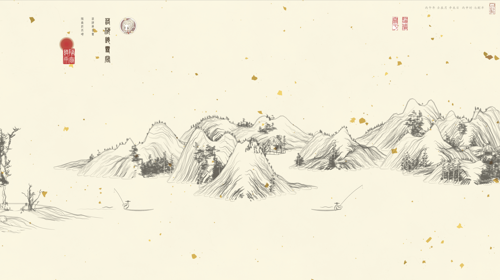
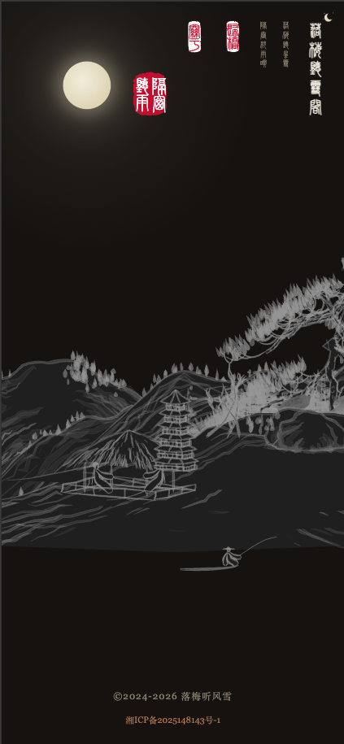
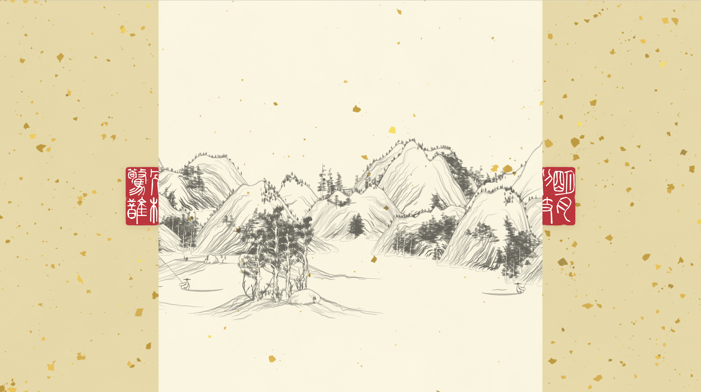

# valaxy-theme-shuimo 水墨

[](https://www.npmjs.com/package/@jobinjia/valaxy-theme-shuimo)

一个中国水墨风格的 [Valaxy](https://github.com/YunYouJun/valaxy) 博客主题。宣纸纹理、毛笔笔触、印章篆刻、四季花卉 —— 以码为墨，以屏为纸。

An ink-wash (水墨) style blog theme for [Valaxy](https://github.com/YunYouJun/valaxy). Xuan paper textures, brush strokes, seal stamps, and seasonal decorations.

版本变化见 [CHANGELOG.md](./CHANGELOG.md)。从 1.x 升级到 2.x 请先看其中的「升级指南」。

## 预览 / Preview

| Light                                 | Dark                                         |
| ------------------------------------- | -------------------------------------------- |
|  |  |

开屏幕布动效 / Curtain reveal animation：



## 特性 / Features

- 宣纸背景纹理（支持 processed / aged / gold 变体）
- 毛笔笔触线条替代 CSS 硬线
- 程序化篆刻印章（阴章/阳章，矩形/方形/圆形/椭圆/多边形），同一 seed 稳定复现
- 首页山水画（桌面端）与花卉背景（移动端），开屏幕布动效
- 四季花卉装饰自动切换
- 深色模式，以及按真实日月位置绘制的天空（夜间月相、白天日轮与晨昏霞光）
- 水墨分享卡片与构建时 OG 图
- 主题预设：`classic` / `night` / `gold` / `minimal` / `album`
- i18n：UI 基础文案（上一篇/下一篇/返回）随 `zh-CN` / `en` 自动切换；主题其余文案（站名、副标题、印章、装饰性 copy）仍以中文书写
- 内置峄山碑篆书字体

## 安装 / Install

```bash
pnpm add @jobinjia/valaxy-theme-shuimo @jobinjia/shuimo-core
```

`@jobinjia/shuimo-core` 在 package.json 里是可选的 peer 依赖，但主题的宣纸纹理、首页山水、印章、移动端花卉和分享卡片都由它生成，正常使用请一起安装。

| 主题版本 | 需要的 `@jobinjia/shuimo-core` |
| -------- | ------------------------------ |
| 2.x      | `>=3.0.0`                      |
| 1.x      | `>=2.0.3 <3`                   |

可选安装 `@jobinjia/vite-plugin-shuimo-font-subset` 以在站点构建时按实际用字进一步裁剪内置篆书字体（`yishanbeizhuanti.woff2`）。不安装也能正常使用，主题会回退到打包内的 ~280KB top-1000 汉字子集；安装后构建产物体积通常可降到几十 KB：

```bash
pnpm add -D @jobinjia/vite-plugin-shuimo-font-subset
```

启用后无需任何配置 —— 主题会自动加载该插件并扫描 `pages/**/*.{md,mdx,vue}` 与 `valaxy.config.{ts,js,mjs}` 收集字符。

构建时生成 OG 分享图还需要 `@napi-rs/canvas`，见下文[水墨分享卡片](#水墨分享卡片--share-card-og-图)。

## 使用 / Usage

在 `valaxy.config.ts` 中配置：

```ts
import type { ThemeConfig } from 'valaxy-theme-shuimo'
import { defineConfig } from 'valaxy'

export default defineConfig<ThemeConfig>({
  theme: 'shuimo',

  themeConfig: {
    header: {
      title: '墨韵书斋',
      subtitle: '以墨会友 · 以文载道',
    },

    nav: [
      { text: '归档', link: '/archives' },
      { text: '关于', link: '/about' },
    ],

    sidebar: {
      author: {
        name: '墨客',
        motto: '以码为墨，以屏为纸',
        avatar: '/avatar.jpg',
      },
    },

    stamp: {
      author: '受命,于天,既寿,永昌',
      mode: 'yang',
      shape: 'rect',
      seed: 69706,
    },
  },
})
```

## 主题配置 / Theme Config

下面各表的默认值取自主题内置的默认配置。完整类型见 `theme/types/index.d.ts`。

### 基础

| 配置项                  | 类型                                                     | 默认值                  | 说明                                                          |
| ----------------------- | -------------------------------------------------------- | ----------------------- | ------------------------------------------------------------- |
| `preset`                | `'classic' \| 'night' \| 'gold' \| 'minimal' \| 'album'` | -                       | 主题预设，作为底层默认值，你的配置会覆盖它                    |
| `colors.primary`        | `string`                                                 | `'#8B4513'`             | 主色（古铜）                                                  |
| `colors.stamp`          | `string`                                                 | `'#C8102E'`             | 印章色（朱红）                                                |
| `fonts.serif`           | `string`                                                 | `'Noto Serif SC', ...`  | 衬线字体                                                      |
| `fonts.title`           | `string`                                                 | -                       | 标题字体（如 `'YiShanBeiZhuan'` 篆书）                        |
| `fonts.body`            | `string`                                                 | -                       | 正文字体                                                      |
| `fonts.url`             | `string`                                                 | -                       | 外部字体 URL                                                  |
| `header.title`          | `string`                                                 | `'墨韵书斋'`            | 站名                                                          |
| `header.subtitle`       | `string`                                                 | `'以墨会友 · 以文载道'` | 副标题                                                        |
| `footer.since`          | `number`                                                 | `2024`                  | 建站年份                                                      |
| `footer.powered`        | `boolean`                                                | `true`                  | 显示 Valaxy 驱动标识                                          |
| `footer.beian.enable`   | `boolean`                                                | `false`                 | 启用备案号                                                    |
| `footer.beian.icp`      | `string`                                                 | `''`                    | ICP 备案号                                                    |
| `sidebar.author.name`   | `string`                                                 | `'墨客'`                | 作者名（About / 归档 / 分类 / 首页竖排导航 / 文章页均会读取） |
| `sidebar.author.motto`  | `string`                                                 | `'以码为墨，以屏为纸'`  | 座右铭                                                        |
| `sidebar.author.avatar` | `string`                                                 | -                       | 头像路径（首页竖排导航、文章页左上角使用）                    |
| `nav`                   | `NavItem[]`                                              | `[]`                    | 导航项 `{ text, link, icon? }`                                |

### 首页 / Hero

| 配置项                      | 类型                                          | 默认值     | 说明                                                                                                                     |
| --------------------------- | --------------------------------------------- | ---------- | ------------------------------------------------------------------------------------------------------------------------ |
| `hero.seed`                 | `number`                                      | -          | 固定首页山水的 seed，设置后每次加载画面相同                                                                              |
| `hero.showSeedControl`      | `boolean`                                     | `false`    | 显示 seed 控制面板（复制 / 换一幅）                                                                                      |
| `hero.sceneHeight`          | `number`                                      | `800`      | 山水构图的排布高度。2.x 起调大调小都是整体缩放构图（山、水、船等比缩放），800 比例最自然；不影响宽度，视口适配由裁切完成 |
| `hero.mobileFlower.enable`  | `boolean`                                     | `true`     | 移动端首页用花卉背景代替山水                                                                                             |
| `hero.mobileFlower.type`    | `'woody' \| 'herbal' \| 'random' \| 'season'` | `'season'` | 花卉类型；`season` 按季节自动选择                                                                                        |
| `hero.mobileFlower.seed`    | `number`                                      | -          | 固定花卉 seed，不设则每次随机                                                                                            |
| `hero.mobileFlower.opacity` | `number`                                      | `0.8`      | 花卉透明度 (0–1)                                                                                                         |
| `home.postList`             | `boolean`                                     | `true`     | 首页显示文章列表                                                                                                         |
| `preface.quote`             | `string`                                      | -          | 首页卷首语                                                                                                               |
| `preface.source`            | `string`                                      | -          | 卷首语出处，如 `'—— 李白《静夜思》'`                                                                                     |

### 装饰与纸张

| 配置项                          | 类型                              | 默认值        | 说明                                                                               |
| ------------------------------- | --------------------------------- | ------------- | ---------------------------------------------------------------------------------- |
| `decorations.enable`            | `boolean`                         | `true`        | 装饰总开关                                                                         |
| `decorations.seasonAware`       | `boolean`                         | `true`        | 四季花卉自动切换                                                                   |
| `decorations.heroLandscape`     | `boolean`                         | `true`        | 首页山水画                                                                         |
| `decorations.curtainColor`      | `ThemeModeColor`                  | `''`          | 首页幕布颜色，默认跟随纸张底色；支持 `string` 或 `{ light, dark }`                 |
| `decorations.curtainPaperColor` | `ThemeModeColor`                  | `''`          | 首页幕布宣纸底色，默认跟随 `xuanPaper.variant`；支持 `string` 或 `{ light, dark }` |
| `decorations.opacity`           | `number`                          | `0.12`        | 装饰透明度                                                                         |
| `xuanPaper.enable`              | `boolean`                         | `true`        | 启用宣纸纹理                                                                       |
| `xuanPaper.variant`             | `'processed' \| 'aged' \| 'gold'` | `'processed'` | 纸张变体                                                                           |
| `xuanPaper.goldDensity`         | `number`                          | `0.3`         | 洒金密度 (0–1)，仅 `variant: 'gold'` 生效                                          |
| `brushStrokes.enable`           | `boolean`                         | `true`        | 用毛笔笔触替换 CSS 线条                                                            |

### 文章页

| 配置项                       | 类型      | 默认值  | 说明                        |
| ---------------------------- | --------- | ------- | --------------------------- |
| `toc.enable`                 | `boolean` | `true`  | 文章目录                    |
| `toc.maxDepth`               | `2 \| 3`  | `3`     | 目录最大层级（3 = h2 + h3） |
| `readingInfo.enable`         | `boolean` | `true`  | 阅读信息总开关              |
| `readingInfo.wordCount`      | `boolean` | `true`  | 显示字数                    |
| `readingInfo.readingTime`    | `boolean` | `true`  | 显示阅读时长                |
| `readingInfo.updatedTime`    | `boolean` | `false` | 显示更新时间                |
| `readingInfo.originalMark`   | `boolean` | `false` | 显示原创标记                |
| `readingInfo.wordsPerMinute` | `number`  | `300`   | 中文阅读速度（字/分）       |
| `imageCaption.enable`        | `boolean` | `true`  | 图片题注                    |
| `imageCaption.autoNumbering` | `boolean` | `true`  | 题注自动编号                |
| `imageCaption.prefix`        | `string`  | `'图'`  | 编号前缀                    |

### 天空 / Astronomy

按设定坐标计算真实的日月位置：深色模式显示月亮（含月相）与夜雾，浅色模式显示太阳与晨昏霞光。

| 配置项                           | 类型                         | 默认值                                      | 说明                                                                                    |
| -------------------------------- | ---------------------------- | ------------------------------------------- | --------------------------------------------------------------------------------------- |
| `astronomy.enable`               | `boolean`                    | `true`                                      | 总开关                                                                                  |
| `astronomy.location`             | `{ lat, lng, name? }`        | `{ lat: 29.56, lng: 106.55, name: '重庆' }` | 博主默认坐标                                                                            |
| `astronomy.allowVisitorOverride` | `boolean`                    | `true`                                      | 允许访客切换到自己的位置                                                                |
| `astronomy.layers.*`             | `boolean`                    | 全部 `true`                                 | 分层开关：`moon` / `mist` / `vignette` / `sun` / `glowMorning` / `glowDusk` / `skyTint` |
| `astronomy.moon`                 | `{ size, tiltByLatitude }`   | `{ size: 70, tiltByLatitude: true }`        | 月亮直径（px）、月相是否随纬度倾斜                                                      |
| `astronomy.sun`                  | `{ size, color }`            | `{ size: 60, color: '#D9362E' }`            | 太阳直径（px）与颜色                                                                    |
| `astronomy.mist`                 | `{ opacity, driftDuration }` | `{ opacity: 0.12, driftDuration: 120 }`     | 烟雾透明度、漂移周期（秒）                                                              |

### 印章 / Stamp

印章由 `@jobinjia/shuimo-core` 的印章 v2（`generateSealAsync`）生成，主题把下面的字段透传给它。

| 配置项                        | 类型                                                                 | 默认值                   | 说明                                                                    |
| ----------------------------- | -------------------------------------------------------------------- | ------------------------ | ----------------------------------------------------------------------- |
| `stamp.enable`                | `boolean`                                                            | `true`                   | 启用印章                                                                |
| `stamp.author`                | `string`                                                             | `'受命,于天,既寿,永昌'`  | 印章文字，用逗号分列                                                    |
| `stamp.mode`                  | `'yin' \| 'yang'`                                                    | `'yang'`                 | 阴章（红底白字）/ 阳章（白底红字）                                      |
| `stamp.shape`                 | `'auto' \| 'square' \| 'rect' \| 'circle' \| 'ellipse' \| 'polygon'` | `'rect'`                 | 印章形状                                                                |
| `stamp.polygonSides`          | `number`                                                             | `6`                      | `shape: 'polygon'` 时的边数                                             |
| `stamp.polygonOrientation`    | `'flat-top' \| 'point-top'`                                          | `'flat-top'`             | `shape: 'polygon'` 时的朝向                                             |
| `stamp.script`                | `'xiaozhuan' \| 'dazhuan' \| 'jinwen' \| 'jiudiezhuan' \| 'custom'`  | -                        | 篆体字形风格（只改字形几何，不换字体）                                  |
| `stamp.color`                 | `string`                                                             | `'#C8102E'`              | 印泥色                                                                  |
| `stamp.seed`                  | `number`                                                             | `69706`                  | 随机种子，固定后印章稳定复现                                            |
| `stamp.size`                  | `number`                                                             | `56`                     | 作者落款类印章（导航主印章、About 页、文章落款）的默认尺寸（px）        |
| `stamp.decor.size`            | `number`                                                             | 各组件自定               | 装饰类小印章（主题切换、移动端题款、节气印）的尺寸（px）                |
| `stamp.offsetX` / `offsetY`   | `number`                                                             | `0`                      | 文字偏移（-1 ~ 1）                                                      |
| `stamp.padding`               | `number`                                                             | `0`                      | 印面内边距                                                              |
| `stamp.gap`                   | `number`                                                             | `2`                      | 字间距（行列共用）                                                      |
| `stamp.columnGap` / `rowGap`  | `number`                                                             | `2` / -                  | 分别覆盖列间距、行间距                                                  |
| `stamp.stretch`               | `boolean`                                                            | -                        | 拉伸字形填满格子（九叠篆风格）                                          |
| `stamp.cellHeightMode`        | `'uniform' \| 'fit'`                                                 | `'fit'`                  | `fit` 按每行最高的字分配行高                                            |
| `stamp.border`                | `{ thickness, cornerRadius, corner, roughness }`                     | `{ 3, 8, 'round', 0.2 }` | 边框粗细、圆角、角的样式（`none` / `round` / `stone`）、残损程度（0–1） |
| `stamp.carving`               | `{ intensity, breakage }`                                            | `{ intensity: 0.9 }`     | 刀刻强度、崩口                                                          |
| `stamp.ink`                   | `{ density, bleed, grain, aging }`                                   | `{ bleed: 1 }`           | 印泥浓淡、晕染、颗粒、做旧                                              |
| `stamp.notch`                 | `{ strategy, charIndex?, strokeHint?, jitter? }`                     | -                        | 边框留缺                                                                |
| `stamp.pressing`              | `{ rotate, pressure, partialLoss, offset }`                          | -                        | 盖印时的歪斜、压力、缺印                                                |
| `stamp.fontUrl`               | `string`                                                             | 主题自带篆书             | 印章字体文件地址（woff2/ttf/otf，不是 CSS font-family）                 |
| `stamp.fontFallbackUrl`       | `string`                                                             | -                        | 缺字补全字体（仅 TTF/OTF），需配合 `harfbuzzSubsetWasmUrl`              |
| `stamp.harfbuzzSubsetWasmUrl` | `string`                                                             | -                        | `harfbuzz-subset.wasm` 地址（`harfbuzzjs/dist/harfbuzz-subset.wasm`）   |
| `stamp.nav.mode` / `shape`    | 同上                                                                 | `'yang'` / `'rect'`      | 导航菜单印章                                                            |
| `stamp.nav.showIcon`          | `boolean`                                                            | `false`                  | 菜单印章旁显示 icon                                                     |
| `stamp.nav.mainSize`          | `number`                                                             | 回退到 `stamp.size`      | 首页竖排导航里作者主印章的尺寸                                          |
| `stamp.nav.mobileSize`        | `number`                                                             | `40`                     | 移动端菜单印章尺寸（px）                                                |
| `stamp.nav.desktopSize`       | `number`                                                             | `48`                     | 桌面端菜单印章尺寸（px）                                                |
| `stamp.curtain.*`             | `object`                                                             | 见下                     | 开屏幕布印章，独立配置、不继承 `stamp.*`                                |

`stamp.curtain` 的默认值：`author: '墨韵'`、`mode: 'yin'`、`shape: 'rect'`、`seed: 69706`、`size: 200`，其余字段同 `stamp.*`。

旧写法仍然兼容：`type` 等同于 `mode`，`shape: 'rectangle'` 等同于 `'rect'`，两者同时出现时新写法优先。1.x 时代的 `fontSize`、`columnSpacingPx`、`noiseAmountPx`、`textCarving`、`regularShape` 等印章 v1 参数已不再生效。

### `ThemeModeColor`

部分颜色配置（如 `decorations.curtainColor` / `decorations.curtainPaperColor`）支持按亮/暗模式分别指定：

```ts
type ThemeModeColor = string | { light?: string, dark?: string }
```

- 传字符串：亮暗模式共用同一个值
- 传对象：可只写 `light` 或 `dark`，未指定的一侧走主题内置默认值

```ts
const themeConfigExample = {
  decorations: {
    // 单值写法
    curtainColor: '#E8D7A5',
    // 分模式写法
    curtainPaperColor: { light: '#E8D7A5', dark: '#1D2230' },
  },
}
```

## 水墨分享卡片 / Share Card (OG 图)

`shareCard` 提供两项功能：**文章页主动分享按钮**（客户端实时渲染，含印章）和**构建时 OG 图生成**（Node 端静态 PNG，自动注入 `og:image` / `twitter:card` meta）。

### 依赖

| 依赖                    | 用途                            | 说明                                                                                                |
| ----------------------- | ------------------------------- | --------------------------------------------------------------------------------------------------- |
| `@jobinjia/shuimo-core` | 宣纸纹理 + 山水画 + 印章绘制    | 未安装时 `shareCard` 整体不生效                                                                     |
| `@napi-rs/canvas`       | 构建时 OG 图合成（Node Canvas） | 需要 OG 图时自行安装（`pnpm add -D @napi-rs/canvas`）；未安装时构建照常完成，只跳过 OG 图并打印提示 |

2.0.2 之前，未安装 `@napi-rs/canvas` 会导致整份主题配置加载失败（字体裁剪等主题插件随之失效）。请使用 2.0.2 及以上版本。

### 配置项

| 配置项                       | 类型                            | 默认值                      | 说明                                                                                                                                            |
| ---------------------------- | ------------------------------- | --------------------------- | ----------------------------------------------------------------------------------------------------------------------------------------------- |
| `shareCard.enable`           | `boolean`                       | `true`                      | 总开关；`@jobinjia/shuimo-core` 缺席时自动失效                                                                                                  |
| `shareCard.button`           | `boolean`                       | `true`                      | 文章页是否显示「分享」按钮及预览对话框（客户端渲染，含印章）                                                                                    |
| `shareCard.og`               | `boolean`                       | `true`                      | 是否在构建时生成 OG PNG 并注入 `og:image` / `twitter:card` meta                                                                                 |
| `shareCard.variants`         | `('portrait' \| 'landscape')[]` | `['portrait', 'landscape']` | 出哪些版式；`portrait` 竖版用于主动分享，`landscape` 横版用于 OG 链接预览                                                                       |
| `shareCard.portrait.width`   | `number`                        | `1080`                      | 竖版宽度（px）                                                                                                                                  |
| `shareCard.portrait.height`  | `number`                        | `1440`                      | 竖版高度（px）                                                                                                                                  |
| `shareCard.landscape.width`  | `number`                        | `1200`                      | 横版宽度（px），OG 标准宽度                                                                                                                     |
| `shareCard.landscape.height` | `number`                        | `630`                       | 横版高度（px），OG 标准高度                                                                                                                     |
| `shareCard.titleFontPath`    | `string`                        | —                           | 构建时 OG 卡片标题所用 CJK 字体的本地路径（TTF/OTF）。未设置时 OG 卡片中文标题可能显示豆腐块；客户端分享卡片不受影响（走站点已加载的 web 字体） |

```ts
const themeConfigExample = {
  shareCard: {
    enable: true,
    button: true,
    og: true,
    variants: ['portrait', 'landscape'],
    portrait: { width: 1080, height: 1440 },
    landscape: { width: 1200, height: 630 },
    titleFontPath: '/home/user/.fonts/NotoSerifCJK-Regular.ttf',
  },
}
```

### 已知限制

1. **OG 卡片不含印章**：`@jobinjia/shuimo-core` 的 Canvas 印章渲染仅限浏览器环境，构建时（Node）无法执行。印章会出现在客户端分享按钮的预览卡片里，但不会出现在静态 OG PNG 里。
2. **OG 卡片标题需配置字体**：构建时 Node 没有 web 字体上下文，CJK 标题渲染依赖 `shareCard.titleFontPath` 指向的本地 TTF/OTF 文件。未配置时构建日志会打印提示，OG 图中文标题将显示为系统回退字形（可能是豆腐块）。

## 印章调参 / Stamp Tuning

主题不会二次修改 `shuimo-core` 生成的印章，只把 `themeConfig.stamp` 透传给印章 v2，所以调印章只需改配置。

```ts
const stampConfigExample = {
  stamp: {
    author: '隔窗,听雨',
    mode: 'yang',
    shape: 'rect',
    seed: 69706,
    gap: 2,
    padding: 0,
    border: { thickness: 3, cornerRadius: 8, corner: 'round', roughness: 0.2 },
    carving: { intensity: 0.9 },
    ink: { bleed: 1.0 },
    nav: {
      mode: 'yang',
      shape: 'rect',
      showIcon: false,
      mobileSize: 40,
      desktopSize: 48,
    },
  },
}
```

- 想让外框更规整：`border.roughness` 调低，`border.corner` 用 `'round'` 或 `'none'`
- 想让边缘更古旧：`border.roughness` 调高，`border.corner: 'stone'`，再加 `notch`
- 想让字更松或更紧：调 `gap`、`columnGap`、`rowGap`
- 想控制印面留白：调 `padding`
- 想要刀味更重：调高 `carving.intensity`、`carving.breakage`
- 想稳定复现同一枚印章：固定 `seed`
- 想单独控制菜单印章：调 `stamp.nav.*`

## 开发 / Development

```bash
# 安装依赖
pnpm install

# 启动 demo 站点
pnpm dev

# 代码检查
pnpm lint

# 类型检查
pnpm typecheck

# 单元测试
pnpm test

# 构建 demo (SSG)
pnpm build
```

## 致谢 / Credits

- [shan-shui-inf](https://github.com/LingDong-/shan-shui-inf) — 山水画生成算法参考

## License

MIT
